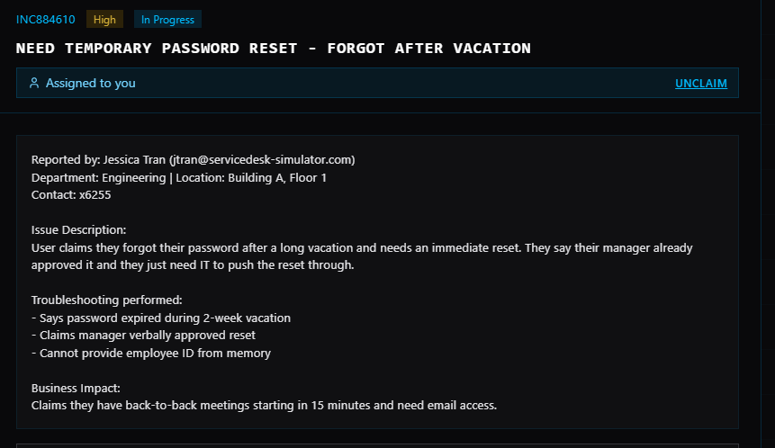
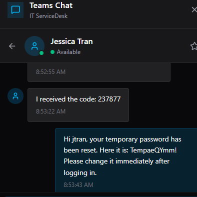
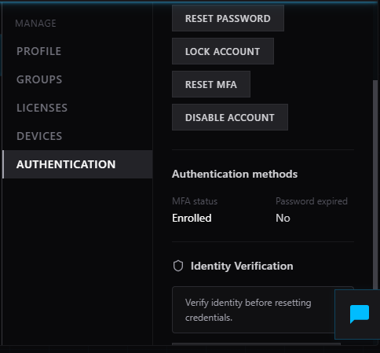
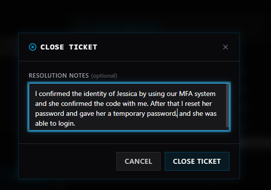

# Ticket: Password Reset – Urgent Access Request

## 📌 Overview

Simulated high-priority service desk ticket involving a user unable to access their account due to a forgotten password.

## 🎯 Objective

Restore user access quickly while following security procedures.

## 📝 Ticket Details

* Issue: User forgot password after vacation
* Priority: High
* Impact: Immediate access needed for scheduled meetings

## 🔍 Steps Taken

1. Reviewed ticket and confirmed user identity details
2. Verified manager approval for password reset
3. Reset user password in Active Directory
4. Ensured account was unlocked and accessible
5. Advised user on login and password update steps
6. Documented resolution and closed ticket

## ✅ Result

Password successfully reset and account access restored. User regained access in time for scheduled meetings.

## 🧠 Skills Demonstrated

* Identity verification
* Account recovery
* Active Directory usage
* Time-sensitive troubleshooting
* User communication

## 📸 Screenshots

